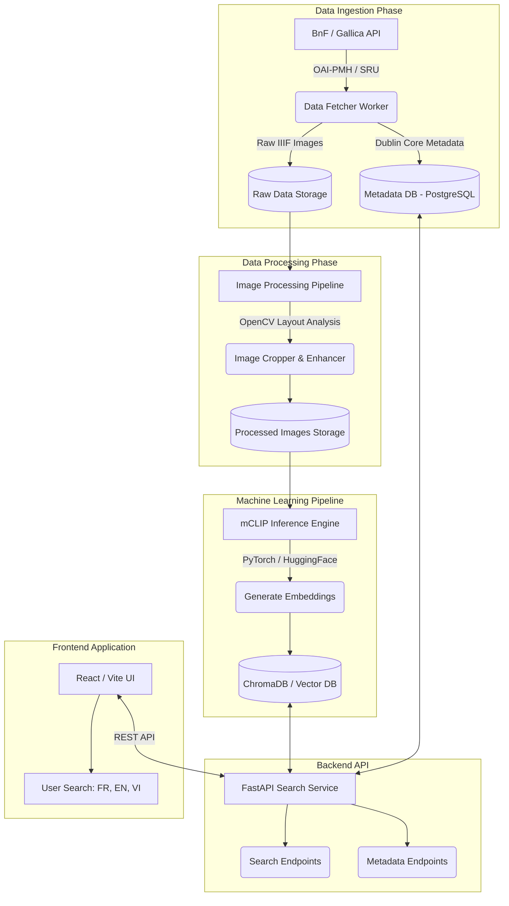
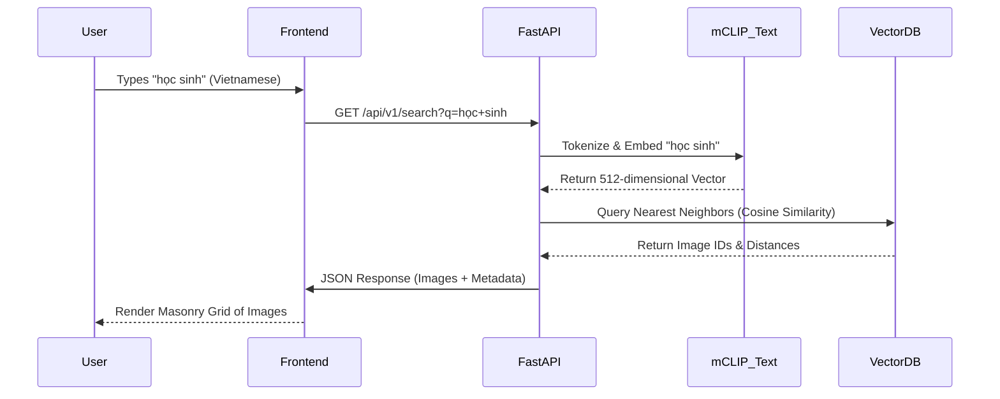

# Historical News Multilingual Search: Master Architecture & Execution Plan


## 📖 1. Executive Summary

The **Historical News Multilingual Search** project is an ambitious, end-to-end AI engineering initiative designed to showcase advanced capabilities in Data Engineering, Computer Vision, Multimodal Machine Learning, and Full-Stack Development. 

The goal is to systematically ingest historical French newspaper archives from the Bibliothèque nationale de France (BnF) via Gallica from the period of 1990 to 2020. The system will extract raw images, isolate photographs and illustrations from the textual layouts, and process these images through a Multilingual Contrastive Language-Image Pretraining (mCLIP) model. This generates high-dimensional vector embeddings, which are stored in a specialized Vector Database. 

The final product is a highly responsive web application that allows users to search for historical imagery using natural language queries in **French, English, and Vietnamese**. By typing a word like "étudiant", "student", or "học sinh", the user will instantly retrieve semantically matching images from decades of historical archives without any manual tagging or traditional metadata classification.

---

## 🏛️ 2. System Architecture & High-Level Design

### 2.1 Architecture Diagram



### 2.2 Data Flow Sequence



---

## 📅 3. Comprehensive Project Master Plan (Phases 1-10)

This section outlines the granular, step-by-step periods required to complete the project. 

### 📌 Phase 1: Project Setup & Infrastructure (Weeks 1-2)
**Goal:** Establish a robust, reproducible development environment following software engineering best practices.

*   **1.1 Repository Initialization**
    *   Initialize Git repository.
    *   Set up `.gitignore` for Python, Node, and Data folders.
    *   Define Branching Strategy (GitFlow: `main`, `develop`, `feature/*`).
*   **1.2 Environment Configuration**
    *   Set up Python virtual environment and package management using **`uv`** (blazing fast Rust-based package manager).
    *   Install base dependencies using `uv pip install -r requirements.txt`.
    *   Set up Node.js environment for the frontend (`npm init`).
*   **1.3 Code Quality & Formatting tools**
    *   Install and configure **`ruff`** as an all-in-one, ultra-fast linter and formatter (replaces `black`, `flake8`, and `isort`).
    *   Install `mypy` for static type checking.
    *   Set up `pre-commit` hooks to run `ruff` and `mypy` before every commit.
*   **1.4 Cloud & Local Infrastructure Planning**
    *   Decide on local storage limits (e.g., max 50GB for PoC).
    *   Set up a local PostgreSQL instance (via Docker) for metadata.
    *   Set up a local ChromaDB instance for vector storage.

### 📌 Phase 2: Data Engineering & Collection (Weeks 3-5)
**Goal:** Build a fault-tolerant web scraper/API client to pull newspaper data from the BnF Gallica archives.

*   **2.1 API Reconnaissance & Authentication**
    *   Read Gallica API Documentation (SRU API for search, IIIF API for images).
    *   Determine rate limits and API restrictions.
    *   Write a test script to query newspaper metadata between 1990-2020.
*   **2.2 Building the Metadata Scraper**
    *   Create a Python script using `requests` to fetch XML/JSON metadata.
    *   Parse publication dates, newspaper titles, and Ark IDs (unique identifiers).
    *   Save metadata to the local PostgreSQL database.
*   **2.3 Building the Image Downloader (IIIF)**
    *   Using the Ark IDs, construct IIIF image URLs.
    *   Implement an asynchronous downloader using `aiohttp` or `asyncio` to speed up fetching.
    *   Implement exponential backoff for failed requests to respect BnF servers.
*   **2.4 Data Integrity Checks**
    *   Write a script to verify downloaded files are not corrupted.
    *   Create a logging system to track exactly which Ark IDs have been successfully downloaded.

### 📌 Phase 3: Data Processing & Computer Vision (Weeks 6-8)
**Goal:** Newspaper scans contain massive amounts of text. We need to isolate the photographs, illustrations, and visual elements.

*   **3.1 Image Standardization**
    *   Convert all downloaded images to a standard format (e.g., JPEG, RGB).
    *   Resize extremely large IIIF images to a manageable maximum resolution to save memory.
*   **3.2 Layout Analysis & Image Extraction**
    *   *Approach A (Traditional CV):* Use OpenCV. Apply thresholding, morphological transformations (dilation/erosion) to find large non-text contours.
    *   *Approach B (Deep Learning):* Use a pre-trained Document Layout Analysis model (e.g., LayoutLMv3 or YOLOv8 trained on document layouts) to detect "Figure" or "Image" bounding boxes.
*   **3.3 Cropping and Saving**
    *   Write a pipeline that takes the bounding boxes and crops the images.
    *   Save cropped images to `data/processed/`.
    *   Update the PostgreSQL database to link the new `cropped_image_id` to the original `parent_newspaper_ark_id`.
*   **3.4 Noise Reduction & Filtering**
    *   Filter out images that are too small (e.g., < 100x100 pixels).
    *   Filter out images that are just large blocks of text (using OCR like Tesseract to check if the "image" is >80% text).

### 📌 Phase 4: Machine Learning & Embedding Generation (Weeks 9-11)
**Goal:** Convert the raw processed images into mathematical vectors using a state-of-the-art multimodal AI.

*   **4.1 Model Selection & Loading**
    *   Select the exact model: `sentence-transformers/clip-ViT-B-32-multilingual-v1` (an excellent mCLIP model).
    *   Write a script to load the model into PyTorch, ensuring it utilizes the GPU (CUDA/MPS) if available.
*   **4.2 The Inference Pipeline**
    *   Write a PyTorch `DataLoader` to efficiently read batches of processed images from disk.
    *   Apply the necessary CLIP preprocessing (resizing to 224x224, center crop, normalization).
    *   Run the forward pass through the vision encoder to generate image embeddings.
*   **4.3 Handling Scale**
    *   Implement batch processing to prevent out-of-memory (OOM) errors.
    *   Save intermediate embedding results to `.npy` (NumPy arrays) or `.pt` files as backups.
*   **4.4 Multilingual Text Embedding Tests**
    *   Create a Jupyter Notebook to test the text encoder.
    *   Verify that `model.encode("étudiant")` and `model.encode("student")` produce high cosine similarity.

### 📌 Phase 5: Vector Database Architecture (Weeks 12-13)
**Goal:** Store the embeddings in a database optimized for High-Dimensional Nearest Neighbor Search (ANN).

*   **5.1 Vector DB Initialization**
    *   Set up ChromaDB (or Qdrant) in persistent local mode.
    *   Define the collection schema (Dimensions = 512 for standard CLIP).
*   **5.2 Data Ingestion**
    *   Write a script to read the `.npy` files and insert them into the Vector DB.
    *   Ensure metadata (Date, Original Newspaper, Ark ID) is attached to the vector payload inside the DB for easy filtering.
*   **5.3 Query Optimization**
    *   Test query speeds. Ensure responses are under 100ms.
    *   Experiment with indexing parameters (HNSW graph settings) if the dataset grows beyond 100,000 images.

### 📌 Phase 6: Backend API Engineering (Weeks 14-15)
**Goal:** Expose the Machine Learning model and Database via a RESTful API.

*   **6.1 FastAPI Setup**
    *   Initialize the FastAPI app.
    *   Set up CORS middleware to allow the frontend to communicate.
*   **6.2 Route Definition**
    *   `GET /api/v1/search?query={text}&language={lang}&limit=50`: The main search endpoint.
    *   `GET /api/v1/image/{image_id}`: Returns the physical image file.
    *   `GET /api/v1/stats`: Returns dataset statistics (number of images, dates).
*   **6.3 Request Flow Implementation**
    *   Inside the `/search` endpoint:
        1. Receive the text query.
        2. Pass the text to the loaded mCLIP text encoder.
        3. Get the text vector.
        4. Query ChromaDB with the text vector.
        5. Return the top N results as a JSON response.
*   **6.4 Memory Management**
    *   Ensure the mCLIP model is loaded ONCE globally when the FastAPI server starts (using `@app.on_event("startup")`), not on every request.

### 📌 Phase 7: Frontend Engineering (Weeks 16-18)
**Goal:** Build a beautiful, responsive user interface for searching the archives.

*   **7.1 Project Initialization**
    *   Create a Vite + React + TypeScript project.
    *   Install TailwindCSS for rapid UI styling.
*   **7.2 UI/UX Design Implementation**
    *   Design a prominent search bar (Google style).
    *   Implement a masonry grid layout (Pinterest style) to display images of varying aspect ratios.
    *   Implement a language toggle switch (FR, EN, VI).
*   **7.3 State Management & API Integration**
    *   Use React Hooks (`useState`, `useEffect`) or `TanStack Query` to handle API requests.
    *   Implement loading states (skeletons/spinners) while the API searches.
    *   Implement empty states ("No images found").
*   **7.4 Advanced Features**
    *   Clicking an image opens a Modal showing details (Date published, Newspaper name, Link to original Gallica archive).
    *   Implement infinite scrolling or pagination for search results.

### 📌 Phase 8: Testing, QA & Optimization (Weeks 19-20)
**Goal:** Ensure the system is robust, fast, and bug-free.

*   **8.1 Unit Testing**
    *   Write `pytest` cases for the data processing pipeline (testing image cropping logic).
    *   Write tests for the FastAPI endpoints using `TestClient`.
*   **8.2 AI/Search Evaluation**
    *   Create a benchmark dataset of 50 queries in 3 languages.
    *   Manually evaluate if the top 5 images returned by the system are semantically relevant to the query.
*   **8.3 Performance Profiling**
    *   Check for memory leaks in the Python backend.
    *   Optimize React re-renders.

### 📌 Phase 9: Deployment & DevOps (Weeks 21-22)
**Goal:** Package the application and make it accessible on the internet for recruiters to see.

*   **9.1 Dockerization**
    *   Write a `Dockerfile` for the FastAPI backend (including downloading the ML model during the build step).
    *   Write a `Dockerfile` for the React frontend (Nginx multi-stage build).
    *   Create a `docker-compose.yml` to spin up the Backend, Frontend, and Vector DB together.
*   **9.2 CI/CD Automation**
    *   Set up GitHub Actions to automatically run linting and tests on every push.
*   **9.3 Cloud Deployment**
    *   Deploy the Backend on a VPS (DigitalOcean, AWS EC2, or Hetzner) since ML models require decent RAM.
    *   Deploy the Frontend on Vercel or Netlify.

### 📌 Phase 10: Documentation & CV Preparation (Week 23)
**Goal:** Finalize the project so it looks professional to technical recruiters.

*   **10.1 System Documentation**
    *   Finalize this README with actual screenshots of the working app.
    *   Write API documentation using Swagger UI (built into FastAPI).
*   **10.2 Portfolio Integration**
    *   Record a 2-minute demo video showing the search working in French, English, and Vietnamese.
    *   Add the project to your CV with strong bullet points emphasizing the impact and technologies used.

---

## 💾 Detailed Database Schemas

### PostgreSQL Metadata Schema (Relational)
```sql
CREATE TABLE newspapers (
    ark_id VARCHAR PRIMARY KEY,
    title VARCHAR,
    publication_date DATE,
    publisher VARCHAR,
    page_count INT
);

CREATE TABLE extracted_images (
    image_id UUID PRIMARY KEY,
    ark_id VARCHAR REFERENCES newspapers(ark_id),
    page_number INT,
    file_path VARCHAR,
    extraction_confidence FLOAT
);
```

### Vector DB Schema (ChromaDB Payload)
```json
{
  "id": "uuid-1234",
  "embedding": [0.12, -0.45, 0.89, ...], // 512 dimensions
  "metadata": {
    "newspaper_title": "Le Monde",
    "year": 1995,
    "url": "https://gallica.bnf.fr/ark:/..."
  }
}
```

---

## 🌐 API Specification

### `GET /search`
**Parameters:**
- `q` (string): The search query
- `lang` (string): The language of the query (fr, en, vi)
- `limit` (int): Number of results to return

**Response Body (JSON):**
```json
{
  "query": "học sinh",
  "processing_time_ms": 142,
  "results": [
    {
      "image_id": "img-9876",
      "similarity_score": 0.892,
      "newspaper": "Le Figaro",
      "date": "1998-09-02",
      "image_url": "/images/img-9876.jpg"
    },
    ...
  ]
}
```

---

## 🚀 Risk Register & Mitigations

| Risk | Impact | Likelihood | Mitigation Strategy |
|------|--------|------------|---------------------|
| Gallica API blocks IP | High | Medium | Implement strict rate limiting (1 req/sec) and exponential backoff. |
| Out of Memory (OOM) during ML inference | Critical | High | Process images in small batches (e.g., batch_size=16) and release VRAM via `torch.cuda.empty_cache()`. |
| Vector DB becomes too slow | Medium | Low | If dataset exceeds 1M images, migrate from ChromaDB to Qdrant or Milvus which scale better horizontally. |
| Poor layout analysis | High | Medium | Start with a heuristic OpenCV approach. If that fails, fine-tune a YOLOv8 model on 100 manually annotated newspaper pages. |

---

## 📚 Resources & Links
- [BnF Gallica API Documentation](https://api.bnf.fr/)
- [OpenAI CLIP Paper](https://arxiv.org/abs/2103.00020)
- [SentenceTransformers Multilingual CLIP](https://huggingface.co/sentence-transformers/clip-ViT-B-32-multilingual-v1)
- [FastAPI Documentation](https://fastapi.tiangolo.com/)
- [ChromaDB Documentation](https://docs.trychroma.com/)

---
*This README represents the comprehensive master plan for the Historical News Multilingual Search project. All phases should be executed sequentially, utilizing Git feature branches for isolated development.*
