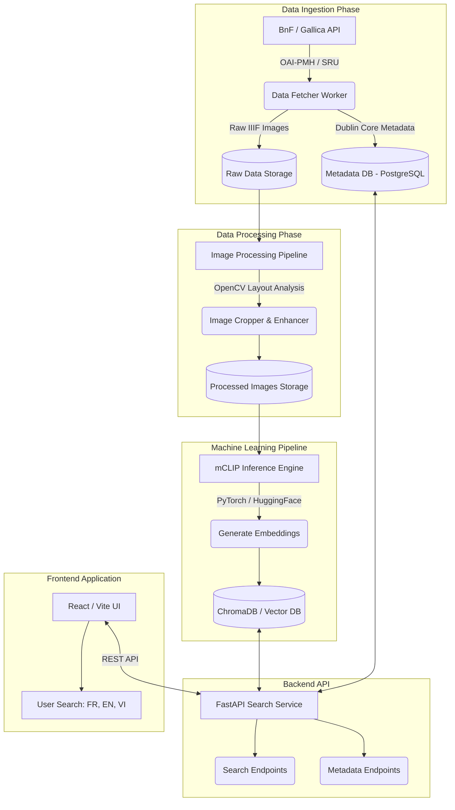
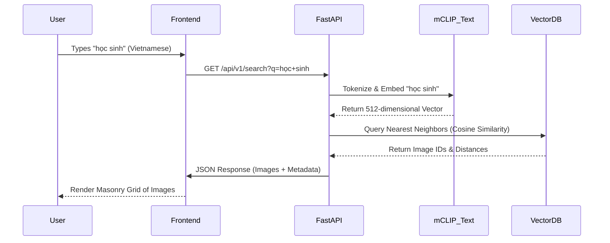

# Historical News Multilingual Search


## 1. Executive Summary

The **Historical News Multilingual Search** project is an ambitious, end-to-end AI engineering initiative designed to showcase advanced capabilities in Data Engineering, Computer Vision, Multimodal Machine Learning, and Full-Stack Development. 

The goal is to systematically ingest historical French newspaper archives from the Bibliothèque nationale de France (BnF) via Gallica from the period of 1990 to 2020. The system will extract raw images, isolate photographs and illustrations from the textual layouts, and process these images through a Multilingual Contrastive Language-Image Pretraining (mCLIP) model. This generates high-dimensional vector embeddings, which are stored in a specialized Vector Database. 

The final product is a highly responsive web application that allows users to search for historical imagery using natural language queries in **French, English, and Vietnamese**. By typing a word like "étudiant", "student", or "học sinh", the user will instantly retrieve semantically matching images from decades of historical archives without any manual tagging or traditional metadata classification.

---

## System Architecture & High-Level Design

### 2.1 Architecture Diagram



### 2.2 Data Flow Sequence



---

## Detailed Database Schemas

### PostgreSQL Metadata Schema (Relational)
```sql
CREATE TABLE newspapers (
    ark_id VARCHAR PRIMARY KEY,
    title VARCHAR,
    publication_date DATE,
    publisher VARCHAR,
    page_count INT
);

CREATE TABLE extracted_images (
    image_id UUID PRIMARY KEY,
    ark_id VARCHAR REFERENCES newspapers(ark_id),
    page_number INT,
    file_path VARCHAR,
    extraction_confidence FLOAT
);
```

### Vector DB Schema (ChromaDB Payload)
```json
{
  "id": "uuid-1234",
  "embedding": [0.12, -0.45, 0.89, ...], // 512 dimensions
  "metadata": {
    "newspaper_title": "Le Monde",
    "year": 1995,
    "url": "https://gallica.bnf.fr/ark:/..."
  }
}
```

---

## API Specification

### `GET /search`
**Parameters:**
- `q` (string): The search query
- `lang` (string): The language of the query (fr, en, vi)
- `limit` (int): Number of results to return

**Response Body (JSON):**
```json
{
  "query": "học sinh",
  "processing_time_ms": 142,
  "results": [
    {
      "image_id": "img-9876",
      "similarity_score": 0.892,
      "newspaper": "Le Figaro",
      "date": "1998-09-02",
      "image_url": "/images/img-9876.jpg"
    },
    ...
  ]
}
```

---

## Risk Register & Mitigations

| Risk | Impact | Likelihood | Mitigation Strategy |
|------|--------|------------|---------------------|
| Gallica API blocks IP | High | Medium | Implement strict rate limiting (1 req/sec) and exponential backoff. |
| Out of Memory (OOM) during ML inference | Critical | High | Process images in small batches (e.g., batch_size=16) and release VRAM via `torch.cuda.empty_cache()`. |
| Vector DB becomes too slow | Medium | Low | If dataset exceeds 1M images, migrate from ChromaDB to Qdrant or Milvus which scale better horizontally. |
| Poor layout analysis | High | Medium | Start with a heuristic OpenCV approach. If that fails, fine-tune a YOLOv8 model on 100 manually annotated newspaper pages. |

---

## Resources & Links
- [BnF Gallica API Documentation](https://api.bnf.fr/)
- [OpenAI CLIP Paper](https://arxiv.org/abs/2103.00020)
- [SentenceTransformers Multilingual CLIP](https://huggingface.co/sentence-transformers/clip-ViT-B-32-multilingual-v1)
- [FastAPI Documentation](https://fastapi.tiangolo.com/)
- [ChromaDB Documentation](https://docs.trychroma.com/)

---
